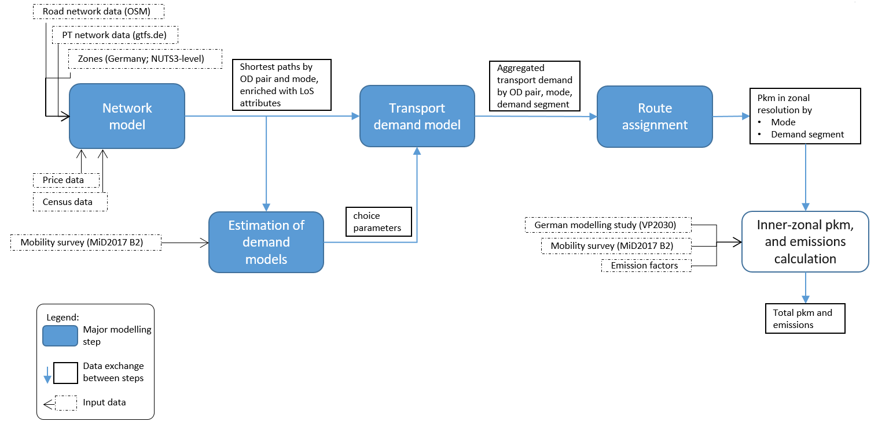

# quetzal_germany
This open source project is a macroscopic passenger transport model for the region of Germany. It supports research aimed at designing an integrated, renewable energy system with mobility behaviour insights. The reference publication can be found here: https://doi.org/10.1186/s12544-022-00568-9

It uses the quetzal transport modelling framework: https://github.com/systragroup/quetzal

The method is oriented towards classical four-step transport modelling. Focus lies on mode choice by using a purpose-segmented logit model.

## Structure

The directory structure is straight-forward:
> quetzal_germany/ 
> -- input/ 
> -- input_static/ 
> -- model/ 
> ---- base/ 
> ---- scenarioX/ 
> -- output/ 
> ---- base/ 
> ---- scenarioX/ 

While input and output data as well as (temporary) model files are stored in seperate folders, Jupyter Notebooks contain all data management and modelling. Briefly, they are structured as follows (`X` as wildcard):
* ``prep1X``: Generation of transport demand zones and all transport networks in high resolution
* ``prep2X``: Aggregation of PT network graph and connection to transport demand sources and sinks
* ``prep3X``: Calculation of shortest paths and enrichment with performance attributes for PT and cars, respectively
* ``calX``: Generation of calibration dataset and estimation of parameters (only applicable with access to calibration data (see below))
* ``model_volumes``: Generation of OD matrix (steps trip generation and distribution together; only applicable with access to volume data (see below))
* ``model_logit``: Mode choice
* ``model_assignment``: Route assignment and results validation
* ``model_emissions``: Calculation of emissions from German passenger transport (post-processing; only applicable with access to inner-zone data (see below))
* ``00_launcher``: Automatically runs all preparation and modelling steps in order
* ``00_test_environment``: Run it to see whether your virtual environment is properly set up

All scenario parameters are saved in the `input/parameters.xls` file.

## Usage

### Installation

1. Create a virtual environment for quetzal models: Clone the quetzal package into a local folder and create a virtual environment as described here *[1]*: https://github.com/systragroup/quetzal
2. Activate your quetzal environment, if not done yet
3. Clone this repository into a local folder: In your terminal, navigate to the position where you want to store the code. Type `git clone <this repo's URL>`. Navigate into the folder `quetzal_germany`.
4. Download static input files from Zenodo *[2]* into a folder named `input_static/` within the `quetzal_germany` repository (see Structure): 
5. Open the local project in Jupyter Notebook (in your terminal type `jupyter notebook`) and start running the notebooks

You can test your virtual environment by running the `00_test_environment` notebook.

*[1]*: If you face problems importing geopandas, consider uninstalling package `rtree` and reinstalling a version up to 0.9.3 (`conda install -c conda-forge rtree=0.9.3`) or uninstalling the whole environment and reinstalling it with the requirements file posted in this [issue](https://github.com/systragroup/quetzal/issues/45). If you have problems with `numba` or others, consider fetching an earlier, more stable, version of `quetzal` with this commit: `git checkout 1126c05c8366e871893b85a55bd57d9d20e7d1d0`
*[2]*: If you wonder why these files are not hosted in this very repository: Large input data files require different handling and some of them also require a license different to this repo's licensing.

### First model run

This repository (together with static input data) contains road and public transport (incl. air) networks, aggregated networks, and estimation results for the mode choice model. Thus, you can simply execute all `prep3X` notebooks from the `00_launcher` notebook in order to generate the level-of-service (LoS)-shortest-paths-stack and then run the classic transport modelling steps (generation, distribution, mode choice, assignment). You can adjust all assumptions in the `parameters.xls` file, if you want to simulate an alternative transport system.

Note: If you want to run the model on a laptop with at least 8GB RAM, you should use the NUTS3-level zoning system. Read the cooresponding section in `00_launcher`. Otherwise, you'll need 150GB RAM.

Detailed descriptions what the notebooks do are to be found as comments. Your StepModel object (always abbreviated with `sm`) is where the magic happens. It saves all tables as attributes (pandas `DataFrame`s) and provides all transport modelling specific functions from the quetzal library. Quetzal provides wrapper function for classic steps in aggregated transport modelling (trip generation, assignment, etc.), which execute a set of more specific functions. Due to a higher degree of customisation, this model uses quetzal's specific functions in many places.

If you don't have access to travel demand data (see below), you can only run `prepX` notebooks and `model_logit` - mode choice.

### Example for custom region (or new generation of networks)

Notebook `prep10` creates the four step model (`sm`) with a zones table that you specify. By default, it contains all NUTS3 zones of Germany, but you can limit it to the desired region or refine it with higher resolution data.

Notebooks `prep11` to `prep14` create road and PT networks from OpenStreetMap and German-wide GTFS feeds, respectively. They will be saved in `sm.road_links`/`sm.road_nodes` and `sm.links`/`sm.nodes`, respectively. Additionally, a list `sm.pt_route_types` is created. Make sure you uncomment the cell where you spatially restrict the network graph, if you want a smaller region. Notebook `prep15` creates distances from all population points in the latest census to your PT stops (make sure to spatially restrict this one too). This data is used to parametrise PT access and egress links.

Notebooks `prep2X` aggregate yor network and create access/egress links between zones' demand centroids and the PT stops or road nodes, respectively. There are two methods used for PT network aggregation, which is necessary in order to reduce computation time for path finders and all other methods:
* Clustering short-distance stops
* Aggregation of PT network to relevant trips and stops with simultaneous connection to zone centroids (size and quality of the network depend on your definition of 'relevant')
* Subsequently, the road network gets connected

The rest works straight-forward with the notebooks' comments and should work for every self-defined region with minor adjustments. At the end of each notebook in the 'save' cell(s) you find all DataFrames (as `sm`'s attributes) that will be relevant in later steps. One additional attribute is always present: `sm.epsg` which defines the coordinate reference system.

### Results

Results of the inter-zonal model (NUTS3 resolution) are computed and validated in `model_assignment`, while results for whole Germany need inner-zonal traffic as well. This is computed under use of restrictively licensed data (see below; notebook `model_assignment_inner-zonal`). Combined results, which are eligible for comparison to other studies, are created in `model_emissions`.

### Scenarios

You can define own scenarios "the quetzal way": Open the `parameters.xls` file and add a new column with your scenario name. Name it under "general/description" and refer to "base" as a "general/parent" scenario. All values, which you don't change in your new column are taken from the parent column.

You can now adjust parameters and run the model with new values. To do so, either use the `00_launcher` by typing your scenario name (column name in `parameters.xls`) in the list of scenarios (fourth cell). All scenario names in this list will be executed in parallel. The other option is running the notebooks manually and defining the variable `scenario` to your name (see very first cell).

### Data accessibility

This repository together with externally hosted data packages contains all openly licensed data sources which are necessary for transport modelling in Germany.

Though, for estimating calibration parameters (beyond the estimation results given in `input/`) and assignment of absolute traffic flows, there are additional data sources needed:
* Calibration uses a large national survey of mobility behaviour "[Mobilität in Deutschland 2017](http://www.mobilitaet-in-deutschland.de/) B2" (MiD2017)
* Assignment uses modified origin destination matrices from the underlying model of the German federal governments transport study "[Bundesverkehrswegeplan 2030](https://www.bmvi.de/SharedDocs/DE/Artikel/G/BVWP/bundesverkehrswegeplan-2030-inhalte-herunterladen.html)"

You can apply for access to both data sets using the national [Clearing House Transport order form](https://daten.clearingstelle-verkehr.de/order-form.html) . All `csv` and `xlsx` data tables go into the folder `input/transport_demand`, which added to the `.gitignore`.

